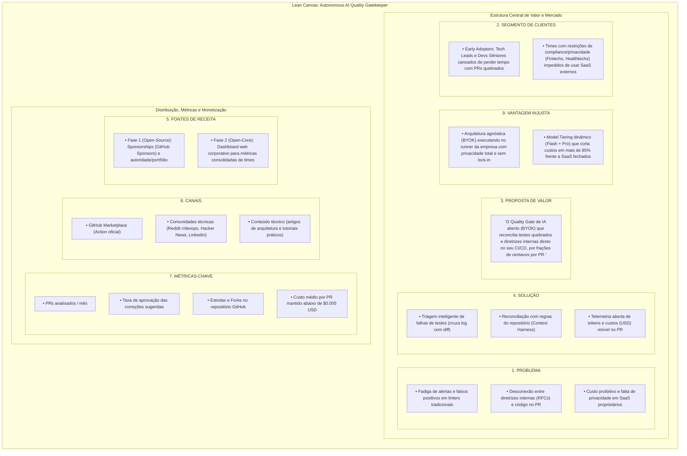
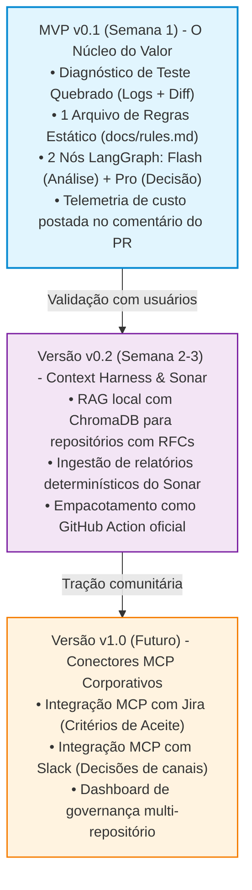
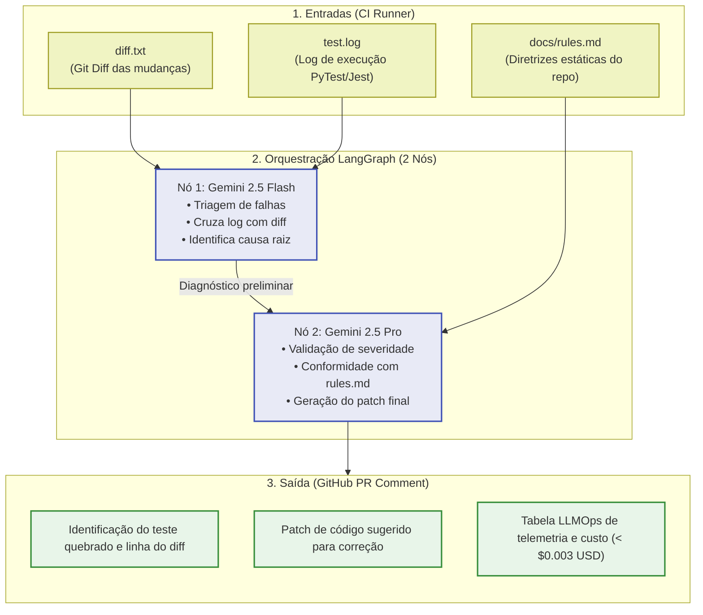
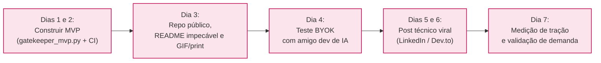

# Lean Canvas & Definição de MVP: Autonomous AI Quality Gatekeeper

> **Abordagem Lean:** Em vez de tentar construir todo o ecossistema de uma vez (Jira + Slack + Sonar + ChromaDB + Multiagentes complexos), mapeamos o modelo de negócio enxuto e recortamos o **Menor Produto Viável (MVP)** para validar a tese no mercado com o menor esforço e o maior impacto possível.

---

## 1. Lean Canvas do Projeto

### Diagrama Visual do Modelo de Negócio

### Detalhamento dos Blocos do Lean Canvas

| Bloco | Detalhes |
| :--- | :--- |
| **1. Problema** | • Fadiga de alertas e falsos positivos em linters tradicionais. • Desconexão entre diretrizes internas (RFCs) e o código submetido no PR. • Custo proibitivo e falta de privacidade em SaaS de IA proprietários. |
| **4. Solução** | • Triagem inteligente de falhas de testes (cruza log com diff). • Reconciliação com regras do repositório (Context Harness). • Telemetria aberta de tokens e custos (USD) visível no PR. |
| **3. Proposta de Valor** | *"O Quality Gate de IA aberto (BYOK) que reconcilia testes quebrados e diretrizes internas direto no seu CI/CD, por frações de centavos por PR."* |
| **9. Vantagem Injusta** | • **Arquitetura agnóstica (BYOK)** que roda dentro do runner da empresa, garantindo privacidade total sem lock-in. • **Model Tiering dinâmico (Flash + Pro)** que corta custos em mais de 85% frente a SaaS fechados. |
| **2. Segmento de Clientes** | • **Early Adopters:** Tech Leads e Devs Sêniores cansados de perder tempo com PRs quebrados e ruídos. • **Times de Engenharia** com restrições de compliance/privacidade (Fintechs, Healthtechs) que não podem usar SaaS externos. |
| **8. Canais** | • GitHub Marketplace (Action oficial). • Comunidades técnicas (Reddit `r/devops`, Hacker News, LinkedIn). • Conteúdo técnico (artigos de arquitetura e tutoriais práticos). |
| **7. Métricas-Chave** | • PRs analisados / mês. • Taxa de aprovação das correções sugeridas. • Estrelas e Forks no repositório GitHub. • Custo médio por PR mantido < $0.005 USD. |
| **5. Fontes de Receita** | • **Fase 1 (Open-Source):** Sponsorships (GitHub Sponsors) e portfólio. • **Fase 2 (Open-Core):** Dashboard web corporativo para métricas consolidadas de times. |

---

## 2. O Maior Erro do Escopo Inicial: O Risco de Sobrecarga

Se começarmos implementando simultaneamente:
- [ ] MCP Server do Jira;
- [ ] MCP Server do Slack;
- [ ] ChromaDB vetorial local;
- [ ] Integração profunda com SonarQube SARIF;
- [ ] 5 agentes em grafo cíclico...

👉 **O projeto demorará meses para rodar, será difícil de depurar e ninguém conseguirá testar com facilidade.**

> 💡 **O segredo do Lean** é achar a fatia vertical mais fina que gera o momento *"UAU"* na primeira execução.

---

## 3. O Recorte Lean: Decomposição em Fases

---

## 4. Especificação do MVP v0.1 (O Que Construir Agora)

### O Problema que o MVP Resolve no Dia 1
> Todo desenvolvedor odeia abrir um PR, ver o CI vermelho porque um teste unitário quebrou e ter que rolar 500 linhas de logs do GitHub Actions para descobrir o que aconteceu.

### O Que Entra no MVP v0.1

1. **Entrada 1:** O arquivo `diff.txt` gerado pelo git.
2. **Entrada 2:** O arquivo `test.log` (extraído da execução do PyTest, Jest ou similar no CI).
3. **Entrada 3:** Um arquivo simples `docs/rules.md` (regras básicas de arquitetura da equipe injetadas diretamente no prompt, sem banco vetorial ainda).
4. **Orquestração LangGraph Enxuta (2 nós):**
   - **Nó 1 (Gemini 2.5 Flash):** Analisa o log do teste, cruza com as linhas modificadas no diff e identifica a causa raiz.
   - **Nó 2 (Gemini 2.5 Pro):** Valida a severidade, confere com o `rules.md` e formata o parecer final.
5. **Saída:** Um comentário no PR no GitHub contendo:
   - Teste exato que quebrou e a linha do diff responsável;
   - Bloco de código sugerindo o patch de correção;
   - Tabela de LLMOps mostrando quanto custou a análise em centavos (USD).

### Arquitetura do Pipeline do MVP v0.1

---

## 5. Experimento Lean: Como Validar em 7 Dias

Para validar se o projeto tem tração real antes de gastar semanas codificando integrações complexas:

### Roteiro Diário de Validação

1. **Dia 1 e 2:** Escrever o script Python do MVP (`gatekeeper_mvp.py`) com LangGraph e o workflow simples do GitHub Actions.
2. **Dia 3:** Criar um repositório público com um README impecável, contendo um GIF/print de um PR real onde o agente identifica o bug do teste e posta a correção com a telemetria de custos.
3. **Dia 4:** Testar com o seu amigo que mexe com IA:
   - Pedir para ele rodar no repositório dele colocando apenas a `GEMINI_API_KEY`.
   - Coletar o feedback imediato: *A configuração foi rápida? O comentário foi útil? O custo fez sentido?*
4. **Dia 5 e 6:** Publicar um post técnico curto (no LinkedIn ou Dev.to) com o título:
   > *"Por que paramos de pagar $40/dev em ferramentas de review de PR e construímos nosso próprio Quality Gatekeeper com Gemini Flash por $0.002 por execução."*
5. **Dia 7:** Medir o interesse:
   - Se houver pessoas comentando e pedindo suporte para Sonar e Jira, você validou a demanda antes de codificar a complexidade do MCP.

---

## 6. Critérios de Sucesso do MVP (Go / No-Go)

| Métrica de Validação | Meta Mínima (Sucesso) |
| :--- | :--- |
| **Tempo de Onboarding** | Um desenvolvedor novo consegue rodar no seu repo em **menos de 5 minutos**. |
| **Precisão de Diagnóstico** | Identifica corretamente a linha causadora da quebra de teste em **ao menos 8 de 10 casos reais**. |
| **Custo por PR** | Custo médio de execução mantido **abaixo de $0.003 USD**. |
| **Falsos Positivos** | **Nenhuma recomendação** que quebre padrões estabelecidos no `docs/rules.md`. |
