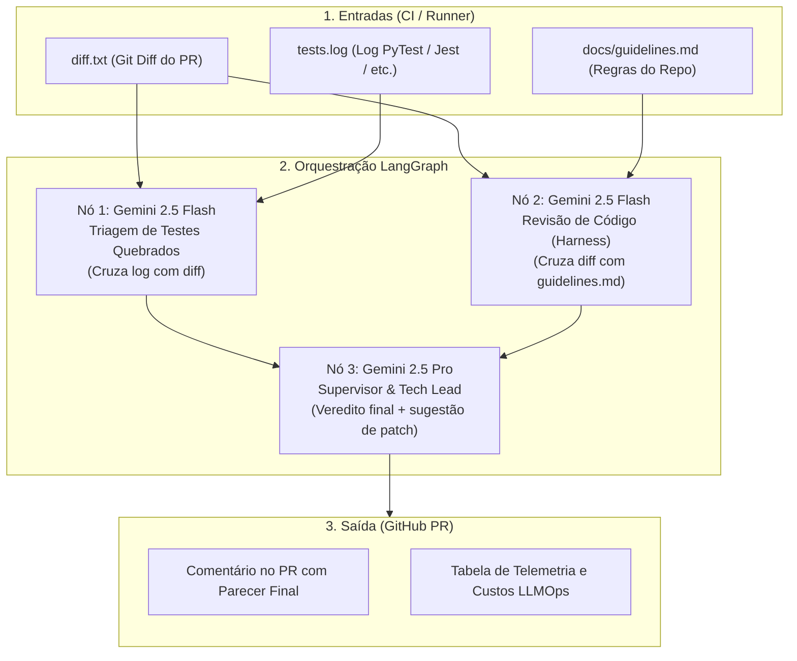

# 🛡️ AI Quality Gatekeeper

> **Autonomous AI Quality Gatekeeper:** Analisador autônomo de Pull Requests com orquestração via **LangGraph** e **Model Tiering** inteligente (Gemini 2.5 Flash + Pro). Triagem de testes quebrados, reconciliação com diretrizes internas e telemetria aberta de custos de LLMOps direto no seu CI/CD.

---

## 🚀 Visão Geral e Arquitetura

O **AI Quality Gatekeeper** atua diretamente no pipeline de CI/CD para resolver duas dores críticas da engenharia moderna:
1. **Fadiga de logs de teste:** Elimina o tempo perdido rolando centenas de linhas de log do CI para entender por que um teste quebrou, correlacionando automaticamente o log com o diff do PR.
2. **Desconexão com diretrizes internas (RFCs):** Valida conformidade estrita com as regras do repositório (`docs/guidelines.md`), alertando violações com severidade `BLOCKER` ou `WARNING`.

### Pipeline de Execução (LangGraph)



---

## ⚡ Diferenciais de Eficiência (Lean LLMOps)

- **Custo Zero quando os testes passam:** Se o log de testes não contiver erros (`FAIL`/`ERROR`), o nó de diagnóstico não aciona a API do modelo, poupando tokens e tempo.
- **Model Tiering Dinâmico:** Utiliza `gemini-2.5-flash` para triagem pesada e rápida (custo de frações de milésimos de centavo) e reserva o `gemini-2.5-pro` exclusivamente para a deliberação do supervisor técnico.
- **Transparência de Custos:** Cada execução gera uma tabela no comentário do PR detalhando tokens de entrada/saída, tempo em segundos e custo estimado em USD (geralmente `< $0.003 USD` por PR).

---

## 📂 Estrutura do Repositório

```text
ai-gatekeeper/
├── .github/
│   └── workflows/
│       └── gatekeeper.yml       # Workflow oficial do GitHub Actions
├── docs/
│   └── guidelines.md            # Regras de arquitetura e qualidade (Context Harness)
├── tests/
│   ├── fixtures/                # Diffs e logs de exemplo para testes locais
│   ├── conftest.py              # Fixtures e mocks para o pytest
│   └── test_gatekeeper.py       # Bateria de testes automatizados
├── .env.example                 # Template de variáveis de ambiente
├── .gitignore                   # Arquivos ignorados pelo Git
├── docker-compose.yml           # Orquestração de containers Docker
├── Dockerfile                   # Imagem Docker padronizada (Python 3.11)
├── gatekeeper.py                # Núcleo de orquestração com LangGraph
├── pytest.ini                   # Configuração de testes unitários
├── requirements.txt             # Dependências principais
├── requirements-dev.txt         # Dependências de desenvolvimento e testes
└── simulate_gatekeeper.py       # Utilitário para simulação local sem GitHub
```

---

## 🛠️ Como Executar com Docker

### 1. Configurar variáveis de ambiente
Copie o template de ambiente e defina sua chave do Google Gemini:
```bash
cp .env.example .env
# Edite o arquivo .env e adicione sua GOOGLE_API_KEY
```

### 2. Rodar a bateria de testes automatizados
```bash
docker compose run --rm test
```

### 3. Simular localmente um PR
Para simular um cenário com código problemático e testes quebrados:
```bash
docker compose run --rm simulate
```

Para rodar a análise do Gatekeeper com as entradas preparadas:
```bash
docker compose run --rm gatekeeper
```

---

## 🧪 Rodando Localmente sem Docker

Caso prefira rodar diretamente no seu ambiente Python (3.10+):

```bash
# Criar e ativar ambiente virtual
python3 -m venv .venv
source .venv/bin/activate

# Instalar dependências de desenvolvimento
pip install -r requirements-dev.txt

# Executar os testes
pytest -v

# Simular e executar o gatekeeper
python simulate_gatekeeper.py --scenario violation --run
```

---

## 🤖 Integração com GitHub Actions

O arquivo [`.github/workflows/gatekeeper.yml`](file:///.github/workflows/gatekeeper.yml) já está pronto para uso. Basta configurar o segredo do repositório:
1. Vá em **Settings** > **Secrets and variables** > **Actions**.
2. Adicione o segredo `GOOGLE_API_KEY` com sua chave do Google AI Studio.
3. Ao abrir qualquer Pull Request para o branch `main`, o Gatekeeper rodará os testes, analisará o diff e publicará o veredito diretamente na conversa do PR!
