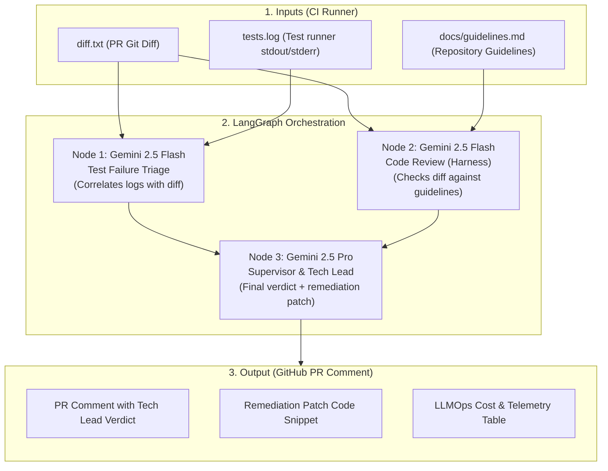

# AI Quality Gatekeeper

> Autonomous PR Quality Gatekeeper built with **LangGraph** and **Dynamic Model Tiering** (Gemini 2.5 Flash + Pro). Automated test failure triage, architecture guideline enforcement (Context Harness), and open LLMOps cost telemetry directly in your CI/CD.

---

## Overview and Architecture

AI Quality Gatekeeper integrates into continuous integration pipelines to resolve two major friction points in modern engineering teams:
1. **CI Log Fatigue:** Eliminates time spent manually parsing hundreds of lines of raw test logs by correlating the test failure traceback directly with the modified lines in the pull request diff.
2. **Architectural Drift:** Automatically reviews diffs against the repository's internal engineering guidelines (`docs/guidelines.md`), flagging `BLOCKER` or `WARNING` violations before human code review begins.

### Execution Pipeline (LangGraph)



---

## Lean LLMOps & Cost Efficiency

- **Zero Cost on Passing Tests:** If the test output does not contain failure keywords (`FAIL`, `ERROR`, `FAILED`), the diagnostics node skips LLM invocation entirely, saving both tokens and latency.
- **Dynamic Model Tiering:** High-volume, fast triage runs on `gemini-2.5-flash` ($0.075 / $0.30 per 1M tokens), reserving `gemini-2.5-pro` strictly for final synthesis and decision-making by the supervisor node.
- **Open Cost Accounting:** Every run posts an itemized table in the PR comment showing prompt tokens, completion tokens, execution seconds, and calculated USD cost (typically below `$0.003 USD` per PR).

---

## Repository Structure

```text
ai-gatekeeper/
├── .github/
│   └── workflows/
│       └── gatekeeper.yml       # Official CI/CD workflow
├── docs/
│   ├── guidelines.md            # Repository standards (Context Harness)
│   ├── folder_structure.md      # Detailed folder layout documentation
│   ├── Lean_Canvas_and_MVP_Strategy.md # Lean canvas and MVP roadmap
│   └── Lean Canvas & Estrategia de MVP.pdf # Original MVP canvas document
├── tests/
│   ├── fixtures/                # Sample diffs and test logs for local simulation
│   ├── conftest.py              # Pytest fixtures and mock objects
│   └── test_gatekeeper.py       # Automated unit and integration test suite
├── .env.example                 # Environment variables template
├── .gitignore                   # Git ignore patterns
├── docker-compose.yml           # Docker services orchestration
├── Dockerfile                   # Python 3.11 slim container definition
├── gatekeeper.py                # Core LangGraph execution engine
├── pytest.ini                   # Pytest configuration
├── requirements.txt             # Core production dependencies
├── requirements-dev.txt         # Testing and development dependencies
└── simulate_gatekeeper.py       # Local PR scenario simulator
```

---

## Running with Docker

### 1. Configure Environment Variables
Copy the template file and define your Google Gemini API key:
```bash
cp .env.example .env
# Edit .env and supply your GOOGLE_API_KEY
```

### 2. Run the Automated Test Suite
```bash
docker compose run --rm test
```

### 3. Run Local Simulation
Prepare sample input files (`diff.txt` and `tests.log`) from fixtures:
```bash
# Simulates a scenario with failing tests and architectural violations
docker compose run --rm simulate
```

Execute the Gatekeeper against the prepared files:
```bash
docker compose run --rm gatekeeper
```

---

## Running Locally Without Docker

For environments with Python 3.10+:

```bash
# Create and activate virtual environment
python3 -m venv .venv
source .venv/bin/activate

# Install dependencies
pip install -r requirements-dev.txt

# Run tests
pytest -v

# Run simulation
python simulate_gatekeeper.py --scenario violation --run
```

---

## How to Download and Configure in Another Project's CI/CD

To use AI Quality Gatekeeper in another repository (Python, Node.js, Go, Java, Rust, etc.), follow these steps:

### Step 1: Add Guidelines to the Target Repository
Create `docs/guidelines.md` in the root of your target project. This file serves as the **Context Harness** that the LLM uses to evaluate code:

```markdown
# Repository Architecture Guidelines

## 1. Security
- Never commit credentials, tokens, or plain-text connection strings.
- All database queries must be parameterized. No string concatenation in SQL (BLOCKER).

## 2. Quality
- Never leave empty catch/except exception blocks (BLOCKER).
- Functions must not exceed 50 lines of code (WARNING).

## 3. Testing
- New endpoints and domain services must include unit or integration tests (BLOCKER).
```

### Step 2: Add Secret to Target GitHub Repository
1. In your target repository on GitHub, navigate to **Settings** > **Secrets and variables** > **Actions**.
2. Click **New repository secret**.
3. Name: `GOOGLE_API_KEY`.
4. Value: Your Gemini API key from [Google AI Studio](https://aistudio.google.com/).

---

### Step 3: Configure CI/CD Workflow in Target Project

Choose one of the two integration methods below:

#### Option A: Lightweight Download via Remote Script (Recommended)
This method does not require copying source code into your repository. The workflow downloads `gatekeeper.py` directly during CI execution.

Create `.github/workflows/ai-gatekeeper.yml` in your target repository:

```yaml
name: AI Quality Gatekeeper

on:
  pull_request:
    branches: [main, master, develop]

jobs:
  gatekeeper:
    runs-on: ubuntu-latest
    permissions:
      contents: read
      pull-requests: write

    steps:
      - name: Checkout Code
        uses: actions/checkout@v4
        with:
          fetch-depth: 0

      - name: Set up Python
        uses: actions/setup-python@v5
        with:
          python-version: '3.11'

      - name: Install Gatekeeper Dependencies
        run: |
          pip install langgraph>=0.2.0 langchain-google-genai>=2.0.0 pydantic>=2.0.0 python-dotenv>=1.0.0

      # Adapt this step to your project stack (npm test, pytest, cargo test, go test, etc.)
      - name: Run Project Tests
        run: |
          pytest > tests.log 2>&1 || true

      - name: Extract PR Diff
        run: |
          git diff origin/${{ github.base_ref }}...HEAD > diff.txt

      - name: Download and Run Gatekeeper
        env:
          GOOGLE_API_KEY: ${{ secrets.GOOGLE_API_KEY }}
        run: |
          curl -sSL https://raw.githubusercontent.com/JPCalsavara/ai-gatekeeper/main/gatekeeper.py -o gatekeeper.py
          python gatekeeper.py

      - name: Post PR Comment
        if: always()
        env:
          GH_TOKEN: ${{ secrets.GITHUB_TOKEN }}
        run: |
          if [ -f report.md ]; then
            gh pr comment ${{ github.event.pull_request.number }} --body-file report.md
          fi
```

---

#### Option B: Standalone Copy into Target Project
If you prefer full local ownership or customization of the gatekeeper logic in the target repo:

1. Copy the following files into your target repository:
   - `gatekeeper.py` (into root or `.github/scripts/`)
   - `requirements.txt` (or append dependencies to your project dependencies)
   - `.github/workflows/gatekeeper.yml`
2. Adjust paths in `.github/workflows/gatekeeper.yml`:
   ```yaml
   - name: Run Gatekeeper
     env:
       GOOGLE_API_KEY: ${{ secrets.GOOGLE_API_KEY }}
     run: |
       python gatekeeper.py
   ```

---

### Example PR Comment Output

When executed in CI, the Gatekeeper posts a formatted report on the pull request:

```markdown
## AI Quality Gatekeeper Report

### Supervisor Verdict
REJECTED: The pull request contains a failing unit test in tests/test_calc.py and a BLOCKER violation regarding SQL string concatenation in services/user_service.py.

### Test Execution Status
Test test_divide failed with ZeroDivisionError at line 15 in tests/test_calc.py. The calculation function does not handle divisor == 0.

Suggested patch:
```python
def calculate_ratio(dividend: float, divisor: float) -> float:
    if divisor == 0:
        return 0.0
    return dividend / divisor
```

<details>
<summary><b>Code Review Findings</b></summary>

- BLOCKER: User query in get_user_by_name uses string formatting f"SELECT * FROM users WHERE username = '{username}'". Use parameterized queries.
- BLOCKER: Empty except Exception block suppresses errors silently.
</details>

---
### Execution Telemetry (LLMOps)
| Agent | Model | Tokens | Time | Est. Cost |
| :--- | :--- | :--- | :--- | :--- |
| `tests` | `gemini-2.5-flash` | 820 | 0.45s | `$0.00012` |
| `review` | `gemini-2.5-flash` | 940 | 0.52s | `$0.00014` |
| `supervisor` | `gemini-2.5-pro` | 1,450 | 1.82s | `$0.00215` |
| **TOTAL** | — | **3,210** | **2.79s** | **`$0.00241 USD`** |
```
