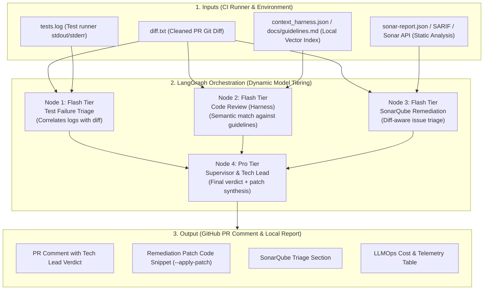

# AI Quality Gatekeeper

> Autonomous PR Quality Gatekeeper built with **LangGraph** and **Dynamic Model Tiering** (Google Gemini, OpenAI, Anthropic Claude, and Local Ollama). Automated test failure triage, architecture guideline enforcement (Context Harness with pre-normalized local JSON embeddings), SonarQube/SonarCloud static analysis triage, automated patch self-healing, diff noise stripping, and open LLMOps cost telemetry directly in your CI/CD.

---

## Version 1.0.0 Production Enhancements

The 1.0.0 release introduces major production-grade optimizations and enterprise-ready features:

1. **Multi-Provider LLM Engine (`llm_factory.py`):**
   - Agnostic model tiering supporting **Google Gemini** (default, zero-cost free tier), **OpenAI** (`gpt-4o-mini` / `gpt-4o`), **Anthropic Claude** (`claude-3-5-haiku` / `claude-3-5-sonnet`), and **Local Ollama** (`llama3.2` / `qwen2.5-coder`).
   - Switch providers effortlessly with `LLM_PROVIDER=gemini|openai|anthropic|ollama`.

2. **Diff Noise & Lockfile Stripping (`clean_diff`):**
   - Automatic pre-filtering of high-volume package lockfiles (`package-lock.json`, `pnpm-lock.yaml`, `yarn.lock`, `poetry.lock`, `Cargo.lock`, `Gemfile.lock`) and minified build artifacts.
   - Enforces configurable token budgets (default 40,000 characters) with graceful truncation notifications.

3. **Diff-Aware SonarQube Filtering:**
   - Evaluates only Sonar issues touching files actively modified in the PR diff.
   - Pre-existing baseline debt in untouched files is counted and reported as ignored, preventing false rejections on legacy codebases.

4. **Automated Self-Healing Patch Application (`--apply-patch`):**
   - Extracts unified remediation diff blocks generated by the supervisor model.
   - Automatically executes `git apply` with `--check` verification when invoked with `python gatekeeper.py --apply-patch` or via the universal review script (`--apply-patch`).

5. **Accelerated Vector Indexing & Cosine Retrieval:**
   - Pre-normalizes all embedding vectors (L2 unit length) during index creation (`context_harness.py`).
   - Replaces O(N * D) square root computations with ultra-fast dot product comparisons (`numpy.dot` vectorization with pure Python fallback).

6. **CI Shallow Clone Auto-Healing:**
   - Universal review workflow (`run_review.sh`) automatically detects Git shallow clones (`--depth=1`) in CI environments and unshallows the target branch (`git fetch --depth=50`) to ensure reliable three-dot diff generation.

---

## Overview and Architecture

AI Quality Gatekeeper integrates into continuous integration pipelines to resolve three major friction points in modern engineering teams:
1. **CI Log Fatigue:** Eliminates time spent manually parsing hundreds of lines of raw test logs by correlating the test failure traceback directly with the modified lines in the pull request diff.
2. **Architectural Drift:** Automatically reviews diffs against the repository's internal engineering guidelines, using semantic search over local vector embeddings (`context_harness.json`).
3. **Deterministic Static Analysis Triage:** Ingests SonarQube / SonarCloud reports (SARIF, JSON, or direct Web API), explains complex vulnerabilities, and generates immediate code patches.

### Execution Pipeline (LangGraph)



---

## Context Harness: Local JSON Embeddings

The **Context Harness** transitions the agent from generic coding advice to adhering strictly to your team's specific architecture standards, RFCs, and ADRs.

### Generating the Local Embeddings Index (`context_harness.json`)
You can scan your documentation and generate a local vector embedding index without external vector databases:

```bash
# Using Python locally
python build_harness.py --docs docs README.md --output context_harness.json

# Using Docker
docker compose run --rm harness
```

### How Semantic Retrieval Works
1. `build_harness.py` chunks markdown headings (`## `), computes vector embeddings via Google's `text-embedding-004`, and writes `context_harness.json`.
2. During PR reviews, `gatekeeper.py` computes the embedding of the pull request diff and performs a pure Python cosine similarity search across all stored chunks.
3. Only the top most relevant guidelines (e.g., SQL security, error handling, function size) are injected into the LLM context, keeping token usage low and preventing hallucinations.
4. If `context_harness.json` is not present, the system automatically falls back to reading `docs/guidelines.md` directly.

### Antigravity Skill
An Antigravity skill is included in [`.agents/skills/context-harness/SKILL.md`](file:///.agents/skills/context-harness/SKILL.md). In the Antigravity IDE or CLI, the agent can be prompted to rebuild the harness whenever new RFCs or ADRs are merged.

---

## SonarQube & SonarCloud Integration (.env, IDE & CI/CD Guide)

The Gatekeeper connects to SonarQube and SonarCloud through a unified static analysis adapter (`sonar_adapter.py`). Consuming issues directly via the **REST API** is the simplest, most lightweight approach—requiring zero local scanner installations or Docker overhead.

### 1. Environment Configuration (`.env`)

Configure your `.env` file in the project root:

#### Scenario A: Personal & Small Projects (SonarCloud Free Tier + GitHub)
SonarCloud offers free automated static analysis for public GitHub repositories:
1. Sign in to [sonarcloud.io](https://sonarcloud.io/) using your GitHub account.
2. Import your repository. Note your **Project Key** (e.g., `octocat_my-project`).
3. Generate a security token under **My Account > Security > Generate Token**.
4. Set the following variables in `.env`:
   ```bash
   SONAR_HOST_URL=https://sonarcloud.io
   SONAR_TOKEN=your_sonarcloud_user_token
   SONAR_PROJECT_KEY=your_project_key
   ```
5. *(Optional for PRs)* Set `PR_NUMBER=12` to restrict fetched issues strictly to new issues introduced in that PR.

#### Scenario B: Corporate Environments (Self-Hosted SonarQube)
For enterprise setups running an internal on-premise SonarQube instance:
```bash
SONAR_HOST_URL=http://sonar.internal.company.com:9000
SONAR_TOKEN=sqp_your_corporate_analysis_token
SONAR_PROJECT_KEY=internal-project-key
```

#### Scenario C: Offline / Fallback Mode (Zero Friction)
If no Sonar credentials or report files are present, the Gatekeeper defaults gracefully to `[PASSED] No SonarQube issues detected.` This ensures local development and onboarding remain unblocked.

---

### 2. Using SonarQube in the IDE (Local Coding & Pair Programming)

While coding in your IDE with **Antigravity (AGY)**, **GitHub Copilot**, **Claude Code**, or **Cursor / GPT**, you can run an instant pre-commit quality review:

```bash
# Automated review of your working branch
bash .agents/skills/ai-gatekeeper-reviewer/scripts/run_review.sh --target .
```

What happens under the hood:
1. The `sonarqube-runner` queries your configured SonarCloud / SonarQube API for unresolved code smells and vulnerabilities.
2. The agent correlates detected Sonar issues with the modified lines in your active git diff.
3. The Supervisor node highlights blockers (e.g., SQL injections, resource leaks) and provides immediate patch recommendations in `report.md` before you push.

---

### 3. Using SonarQube in CI/CD (Automated PR Reviewer)

In GitHub Actions, configure repository secrets for `GOOGLE_API_KEY`, `SONAR_TOKEN`, `SONAR_PROJECT_KEY`, and `SONAR_HOST_URL`.

```yaml
# Sample GitHub Actions Step in .github/workflows/gatekeeper.yml
- name: Run AI Quality Gatekeeper
  env:
    GOOGLE_API_KEY: ${{ secrets.GOOGLE_API_KEY }}
    SONAR_HOST_URL: ${{ secrets.SONAR_HOST_URL || 'https://sonarcloud.io' }}
    SONAR_TOKEN: ${{ secrets.SONAR_TOKEN }}
    SONAR_PROJECT_KEY: ${{ secrets.SONAR_PROJECT_KEY }}
    PR_NUMBER: ${{ github.event.pull_request.number }}
  run: |
    bash .agents/skills/ai-gatekeeper-reviewer/scripts/run_review.sh --target .
```

- If SonarQube or guideline violations are marked as **BLOCKER**, the workflow exits with status code `1`, preventing PR merges.
- If everything passes, the workflow exits with code `0` (APPROVED).

---

### 4. Alternative: File-Based Ingestion (SARIF / JSON)
If your CI/CD runner already executes SonarScanner CLI or exports GitHub Code Scanning alerts, place the output directly in the project root:
- **`sonar-report.json`**: Standard SonarQube JSON issues export.
- **`sonar-report.sarif`**: SARIF 2.1.0 report format.
`sonar_adapter.py` detects and prioritizes local report files before making API network calls.

---

## Lean LLMOps & Cost Efficiency

- **Zero Cost on Passing Tests:** If the test output does not contain failure keywords (`FAIL`, `ERROR`, `FAILED`), the diagnostics node skips LLM invocation entirely.
- **Zero Cost when Sonar is Clean:** If SonarQube reports zero issues, the Sonar node skips LLM calls.
- **Dynamic Model Tiering:** High-volume triage runs on `gemini-2.5-flash` ($0.075 / $0.30 per 1M tokens), reserving `gemini-2.5-pro` strictly for final synthesis and decision-making by the supervisor node.
- **Open Cost Accounting:** Every run posts an itemized table in the PR comment showing prompt tokens, completion tokens, execution seconds, and calculated USD cost (typically below `$0.003 USD` per PR).

---

## Repository Structure

```text
ai-gatekeeper/
├── .agents/
│   └── skills/
│       ├── ai-gatekeeper-reviewer/ # Universal multi-agent review orchestrator
│       │   ├── SKILL.md
│       │   └── scripts/run_review.sh
│       ├── sonarqube-runner/       # SonarQube / SonarCloud API & scanner runner
│       │   ├── SKILL.md
│       │   └── scripts/run_sonar.sh
│       └── context-harness/        # Local JSON vector index builder
│           └── SKILL.md
├── .github/
│   ├── workflows/
│   │   └── gatekeeper.yml       # Official CI/CD workflow
│   └── copilot-instructions.md  # GitHub Copilot custom instructions
├── AGENTS.md                    # Universal AI agent guide (AGY, Copilot, Claude, GPT)
├── CLAUDE.md                    # Claude Code instructions and commands
├── docs/
│   ├── guidelines.md            # Repository standards (Context Harness)
│   ├── folder_structure.md      # Detailed folder layout documentation
│   ├── Lean_Canvas_and_MVP_Strategy.md # Lean canvas and MVP roadmap
│   └── Lean Canvas & Estratégia de MVP.pdf # Original MVP canvas document
├── tests/
│   ├── fixtures/                # Sample diffs, logs, and SonarQube reports
│   ├── conftest.py              # Pytest fixtures and mock objects
│   └── test_gatekeeper.py       # Automated unit and integration test suite
├── .env.example                 # Environment variables template
├── .gitignore                   # Git ignore patterns
├── build_harness.py             # CLI to scan docs and generate local vector index
├── context_harness.py           # Semantic retrieval engine with pure Python cosine similarity
├── docker-compose.yml           # Docker services orchestration
├── Dockerfile                   # Python 3.11 slim container definition
├── gatekeeper.py                # Core LangGraph execution engine
├── pytest.ini                   # Pytest configuration
├── README.md                    # Project documentation & CI/CD setup guide
├── requirements.txt             # Core production dependencies
├── requirements-dev.txt         # Testing and development dependencies
├── simulate_gatekeeper.py       # Local PR scenario simulator with Sonar support
└── sonar_adapter.py             # SonarQube/SonarCloud SARIF, JSON, and Web API adapter
```

---

## Running with Docker

### 1. Configure Environment Variables
Copy the template file and define your Google Gemini API key:
```bash
cp .env.example .env
# Edit .env and supply your GOOGLE_API_KEY
```

### 2. Run the Automated Test Suite
```bash
docker compose run --rm test
```

### 3. Generate the Context Harness Vector Index
```bash
docker compose run --rm harness
```

### 4. Run Local Simulation
Prepare sample input files (`diff.txt`, `tests.log`, and `sonar-report.json`):
```bash
# Simulates a scenario with failing tests, Sonar blockers, and guideline violations
docker compose run --rm simulate
```

Execute the Gatekeeper against the prepared files:
```bash
docker compose run --rm gatekeeper
```

---

## How to Download and Configure in Another Project's CI/CD

To use AI Quality Gatekeeper in another repository (Python, Node.js, Go, Java, Rust, etc.):

### Step 1: Add Guidelines to Target Repository
Create `docs/guidelines.md` in the root of your target project:

```markdown
# Repository Architecture Guidelines

## 1. Security
- Never commit credentials, tokens, or plain-text connection strings (BLOCKER).
- All database queries must be parameterized. No string concatenation in SQL (BLOCKER).

## 2. Quality
- Never leave empty catch/except exception blocks (BLOCKER).
- Functions must not exceed 50 lines of code (WARNING).

## 3. Testing
- New endpoints and domain services must include unit or integration tests (BLOCKER).
```

### Step 2: Add Secrets to Target GitHub Repository
1. In your target repository on GitHub, navigate to **Settings** > **Secrets and variables** > **Actions**.
2. Click **New repository secret**.
3. Name: `GOOGLE_API_KEY` (Value from [Google AI Studio](https://aistudio.google.com/)).
4. (Optional) Name: `SONAR_TOKEN` and `SONAR_HOST_URL` if using SonarQube Web API.

### Step 3: Configure CI/CD Workflow in Target Project

Create `.github/workflows/ai-gatekeeper.yml` in your target repository:

```yaml
name: AI Quality Gatekeeper

on:
  pull_request:
    branches: [main, master, develop]

jobs:
  gatekeeper:
    runs-on: ubuntu-latest
    permissions:
      contents: read
      pull-requests: write

    steps:
      - name: Checkout Code
        uses: actions/checkout@v4
        with:
          fetch-depth: 0

      - name: Set up Python
        uses: actions/setup-python@v5
        with:
          python-version: '3.11'

      - name: Install Gatekeeper Dependencies
        run: |
          pip install langgraph>=0.2.0 langchain-google-genai>=2.0.0 pydantic>=2.0.0 python-dotenv>=1.0.0

      # Adapt this step to your project test stack
      - name: Run Project Tests
        run: |
          pytest > tests.log 2>&1 || true

      # (Optional) Run SonarScanner and output JSON or SARIF report
      - name: Run SonarQube Scan
        run: |
          # sonar-scanner -Dsonar.issuesReport.html.enable=false -Dsonar.issuesReport.json.enable=true
          echo "Sonar scan placeholder"

      - name: Extract PR Diff
        run: |
          git diff origin/${{ github.base_ref }}...HEAD > diff.txt

      - name: Download and Run Gatekeeper
        env:
          GOOGLE_API_KEY: ${{ secrets.GOOGLE_API_KEY }}
          SONAR_TOKEN: ${{ secrets.SONAR_TOKEN }}
          SONAR_HOST_URL: ${{ secrets.SONAR_HOST_URL }}
        run: |
          curl -sSL https://raw.githubusercontent.com/JPCalsavara/ai-gatekeeper/main/gatekeeper.py -o gatekeeper.py
          curl -sSL https://raw.githubusercontent.com/JPCalsavara/ai-gatekeeper/main/sonar_adapter.py -o sonar_adapter.py
          curl -sSL https://raw.githubusercontent.com/JPCalsavara/ai-gatekeeper/main/context_harness.py -o context_harness.py
          curl -sSL https://raw.githubusercontent.com/JPCalsavara/ai-gatekeeper/main/llm_factory.py -o llm_factory.py
          python gatekeeper.py

      - name: Post PR Comment
        if: always()
        env:
          GH_TOKEN: ${{ secrets.GITHUB_TOKEN }}
        run: |
          if [ -f report.md ]; then
            gh pr comment ${{ github.event.pull_request.number }} --body-file report.md
          fi
```
