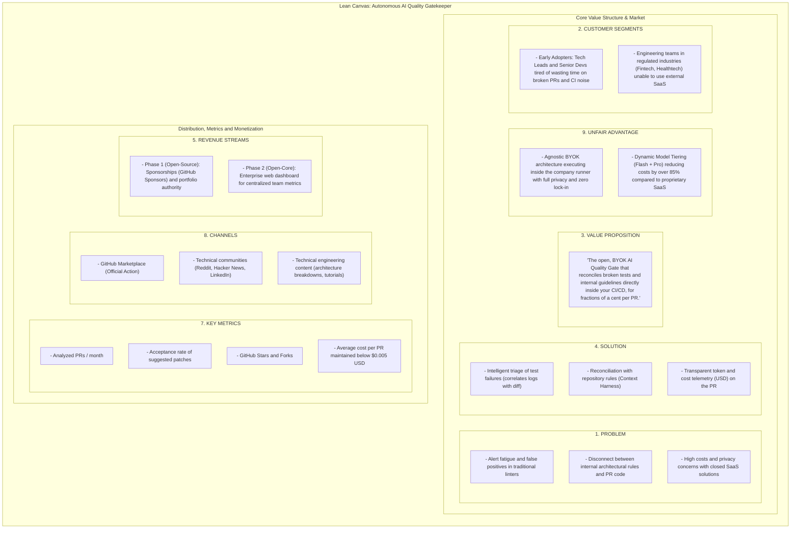
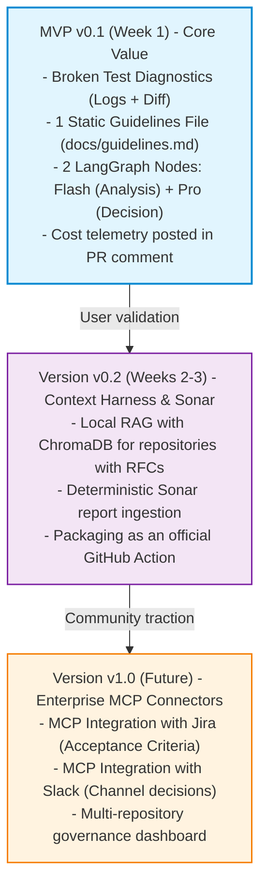
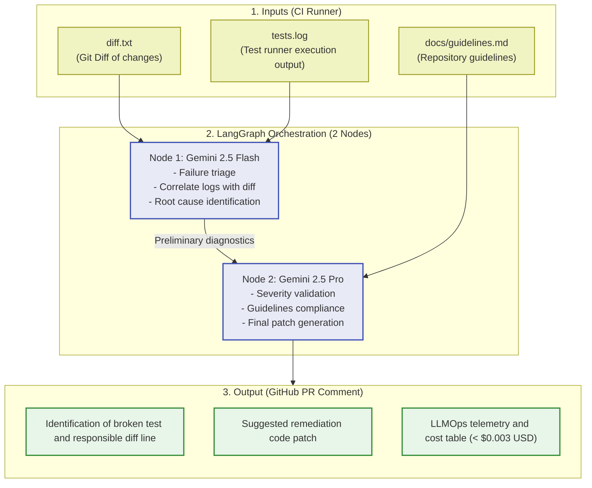
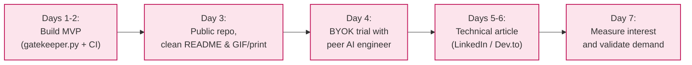

# Lean Canvas & MVP Definition: Autonomous AI Quality Gatekeeper

> **Lean Approach:** Instead of building the entire ecosystem at once (Jira + Slack + Sonar + ChromaDB + complex multi-agent setups), we map the lean business model and scope down to the **Minimum Viable Product (MVP)** to validate market demand with minimal effort and maximum impact.

---

## 1. Project Lean Canvas

### Visual Business Model Diagram

### Detailed Lean Canvas Blocks

| Block | Details |
| :--- | :--- |
| **1. Problem** | - Alert fatigue and false positives in traditional linters. - Disconnect between internal architectural guidelines (RFCs) and submitted PR code. - Prohibitive costs and privacy concerns with proprietary AI SaaS solutions. |
| **4. Solution** | - Intelligent triage of test failures (correlating CI logs directly with diff). - Automated reconciliation with repository guidelines (Context Harness). - Transparent token and cost telemetry (USD) visible in the PR comment. |
| **3. Unique Value Proposition** | *"The open, BYOK AI Quality Gate that reconciles broken tests and internal guidelines directly inside your CI/CD, for fractions of a cent per PR."* |
| **9. Unfair Advantage** | - **Agnostic Architecture (BYOK):** Runs entirely within the organization's runner, ensuring complete privacy with zero vendor lock-in. - **Dynamic Model Tiering (Flash + Pro):** Cuts LLM costs by over 85% compared to monolithic models. |
| **2. Customer Segments** | - **Early Adopters:** Tech Leads and Senior Engineers fatigued by manual CI log inspection and noisy PRs. - **Engineering Teams:** Organizations with compliance and privacy constraints (Fintechs, Healthtechs) prohibited from sending code to external SaaS vendors. |
| **8. Channels** | - GitHub Marketplace (Official Action). - Technical developer communities (Reddit `r/devops`, Hacker News, LinkedIn). - Engineering content (deep-dive architecture articles and practical tutorials). |
| **7. Key Metrics** | - Analyzed PRs per month. - Acceptance rate of suggested code patches. - GitHub repository Stars and Forks. - Average cost per PR maintained below $0.005 USD. |
| **5. Revenue Streams** | - **Phase 1 (Open-Source):** Sponsorships (GitHub Sponsors) and portfolio authority. - **Phase 2 (Open-Core):** Enterprise web dashboard for aggregated cross-team metrics and governance. |

---

## 2. Initial Scope Pitfall: The Risk of Overengineering

Attempting to implement all features simultaneously:
- [ ] Jira MCP Server
- [ ] Slack MCP Server
- [ ] Local vector ChromaDB
- [ ] Deep SonarQube SARIF integration
- [ ] 5-agent cyclical graph...

Result: The project would take months to deliver, would be difficult to debug, and early adoption would stall.

> **Lean Principle:** Identify the thinnest vertical slice that delivers immediate value on first execution.

---

## 3. Lean Scope: Phase Decomposition

---

## 4. MVP v0.1 Specification (Current Scope)

### Problem Solved on Day 1
Developers dislike opening a PR, seeing a failing CI pipeline, and scrolling through 500 lines of raw GitHub Actions logs to pinpoint the issue.

### MVP v0.1 Components

1. **Input 1:** The `diff.txt` generated by git.
2. **Input 2:** The `tests.log` extracted from test runners (PyTest, Jest, Go test, etc.).
3. **Input 3:** A `docs/guidelines.md` file (basic architectural rules injected directly into the prompt without a vector database).
4. **Lean LangGraph Orchestration (2 Nodes):**
   - **Node 1 (Gemini 2.5 Flash):** Analyzes test logs, correlates with modified lines in diff, and identifies the root cause.
   - **Node 2 (Gemini 2.5 Pro):** Validates severity, checks adherence to `guidelines.md`, and formats the final verdict.
5. **Output:** A GitHub PR comment containing:
   - Specific failed test and responsible diff line;
   - Remediation code patch suggestion;
   - LLMOps telemetry table displaying exact cost in cents (USD).

### Pipeline Architecture

---

## 5. 7-Day Lean Validation Experiment

To validate real adoption before committing weeks to complex third-party connectors:

### Daily Action Plan

1. **Days 1 and 2:** Implement the Python script (`gatekeeper.py`) using LangGraph and standard GitHub Actions workflow.
2. **Day 3:** Set up a public repository with documentation, showing a real PR review with test diagnostics and cost telemetry.
3. **Day 4:** Test with a peer engineer:
   - Provide instructions to run with their own `GEMINI_API_KEY`.
   - Collect immediate feedback: Was onboarding fast? Was the feedback actionable?
4. **Days 5 and 6:** Publish a concise technical post:
   > *"Why we stopped paying $40/dev for proprietary PR review tools and built an open Quality Gatekeeper with Gemini Flash for $0.002 per run."*
5. **Day 7:** Measure demand:
   - Inquiries regarding Sonar, Jira, or custom linters validate feature expansion before writing complex code.

---

## 6. Success Metrics (Go / No-Go)

| Validation Metric | Minimum Target (Success) |
| :--- | :--- |
| **Onboarding Time** | A new engineer can run the tool in their repository in **under 5 minutes**. |
| **Diagnostic Accuracy** | Correctly identifies the line causing test failure in **at least 8 out of 10 real cases**. |
| **Cost per PR** | Average execution cost maintained **below $0.003 USD**. |
| **False Positives** | **Zero recommendations** that contradict rules defined in `docs/guidelines.md`. |
