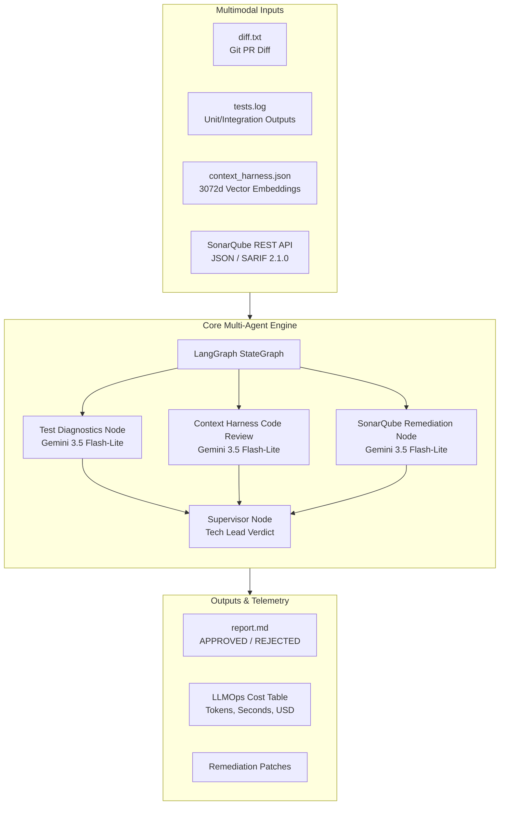
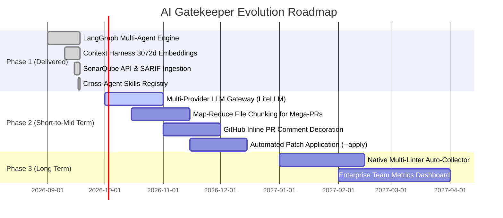

# System Capabilities, Operational Limitations & Technical Roadmap

## Executive Overview

The **AI Quality Gatekeeper** is an autonomous Pull Request review system orchestrating static code analysis (SonarQube/SonarCloud), unit test failure triage, and semantic architecture compliance (Context Harness) using **LangGraph** and **Dynamic Model Tiering** (Google Gemini Flash-Lite / Flash / Pro).

This document serves as an exhaustive technical reference detailing:
1. **Current Capabilities**: Verified functionality operational in the codebase today.
2. **Operational Limitations & Potential Failure Modes**: Identified risks, edge cases, scaling boundaries, and mitigation strategies.
3. **Enhancement Opportunities & Roadmap**: Structured engineering improvements categorized by short-term, mid-term, and long-term milestones.

---

## 1. Current Capabilities (Capacidades Atuais)

### 1.1. LangGraph Parallel Multi-Agent Orchestration
- **Parallel Specialist Nodes**: LangGraph executes three diagnostic nodes simultaneously using `operator.or_` state aggregation to eliminate race conditions and reduce wall-clock execution time by up to 60%.
  - `test_diagnostics_node`: Correlates failure stack traces and exception messages directly with the modified lines in `diff.txt`.
  - `code_review_node`: Evaluates code diffs against semantically retrieved architecture rules, categorizing findings into `BLOCKER` or `WARNING`.
  - `sonar_triage_node`: Cross-references static analysis findings (code smells, security vulnerabilities) with modified lines and generates exact remediation patches.
- **Supervisor Verdict Node**: Acts as the authoritative Tech Lead. Consolidates diagnostic reports, enforces strict policy (`REJECTED` if any test failure, Sonar blocker, or guideline blocker is found), and synthesizes remediation guidance.

### 1.2. Dynamic Model Tiering & LLMOps Telemetry
- **Tiered Model Routing**: High-throughput triage nodes run on `gemini-3.5-flash-lite` (low latency, high RPM/TPM), reserving higher-order reasoning for supervisor synthesis.
- **Graceful Quota Fallback**: If the supervisor node encounters quota exhaustion (`429 RESOURCE_EXHAUSTED`) on free-tier keys, it automatically falls back to Flash-Lite without failing the review pipeline.
- **Open Cost Accounting**: Every execution calculates itemized token usage (input/output), execution duration in seconds, and USD cost per node, maintaining an average cost below `$0.003 USD` per review.
- **Conditional Short-Circuiting (Zero LLM Cost)**:
  - If tests pass cleanly, LLM invocation is skipped (`[PASSED] All tests passed with no errors.`).
  - If SonarQube detects no issues, the node returns immediately with zero token expenditure.

### 1.3. Context Harness Semantic Indexing (Zero External Vector DB)
- **Local JSON Vector Index (`context_harness.json`)**: Eliminates the operational complexity of hosting external vector databases (Pinecone, Qdrant, ChromaDB).
- **Embeddings Generation**: Uses `models/gemini-embedding-001` to generate 3072-dimensional vector embeddings partitioned by markdown headings across `docs/`, `README.md`, and `SPEC-*.md` files.
- **Pure Python Cosine Similarity**: Employs an in-memory cosine similarity engine with zero binary dependencies, ensuring portability across minimal container environments.
- **Automatic Fallback**: If no index exists, smoothly falls back to raw text ingestion from `docs/guidelines.md`.

### 1.4. Unified SonarQube & SonarCloud Integration
- **Direct REST API Ingestion**: Connects over HTTP Basic Auth to query `/api/issues/search?componentKeys=...&resolved=false` directly. Ideal for personal projects using free SonarCloud accounts with zero local scanner overhead.
- **Static File Ingestion**: Ingests `sonar-report.json` or standard GitHub Code Scanning `sonar-report.sarif` (SARIF 2.1.0).
- **Graceful Offline Degradation**: When no Sonar server is reachable or credentials are omitted, the gatekeeper defaults to `[PASSED] No SonarQube issues detected.`, ensuring developers are never blocked offline.

### 1.5. Universal Cross-Agent Skill Registry (`.agents/skills/`)
The repository is fully cross-compatible with the standard Agent Skills specification:
- **`ai-gatekeeper-reviewer`**: Master review orchestrator (`run_review.sh`).
- **`sonarqube-runner`**: Dedicated static analysis runner and API syncer (`run_sonar.sh`).
- **`context-harness`**: Vector indexing utility.
- Native integration guides provided for **Google Antigravity (AGY)**, **GitHub Copilot** (`.github/copilot-instructions.md`), **Claude Code** (`CLAUDE.md`), and **OpenAI GPT / Cursor** (`AGENTS.md`).

### 1.6. Multi-Target Project Support
- Operates either within its own repository or against external targets via `--target <path>`.
- Auto-detects target test frameworks (Node.js/Vitest/Jest, Python/pytest, Go test, Rust/cargo test).
- Validated end-to-end against real-world projects (e.g., `Semeia-Code` Vitest suite).

---

## 2. Operational Limitations & Failure Modes (Problemas Possíveis e Limitações)

### 2.1. Mega-Diffs & Token Rate Limit Saturation (TPM Spikes)
- **Risk**: Pull requests modifying >2,000 lines or >50KB of diff text can consume substantial prompt token budgets in a single call.
- **Failure Mode**: Free-tier Gemini API keys risk encountering `429 RESOURCE_EXHAUSTED` (token per minute limits) or HTTP 504 gateway timeouts.
- **Mitigation**:
  - `gemini-3.5-flash-lite` provides generous throughput.
  - Diff truncation or subsystem chunking should be applied for diffs exceeding 60,000 characters.

### 2.2. Baseline Legacy Sonar Issue Pollution
- **Risk**: In legacy corporate repositories containing hundreds of pre-existing unresolved issues on the base branch, querying `/api/issues/search` without PR branch decoration returns historical debt unrelated to the active PR.
- **Failure Mode**: The agent may evaluate or reject a PR based on legacy code smells outside the current diff.
- **Mitigation**:
  - Always supply `PR_NUMBER` when running on pull requests to leverage SonarCloud PR branch analysis.
  - The `sonar_adapter.py` filters issues by cross-referencing issue file paths and line numbers against the files modified in `diff.txt`.

### 2.3. Shallow Git Clones in CI Runners (`fetch-depth: 1`)
- **Risk**: Default GitHub Actions checkouts (`actions/checkout@v4`) execute with `fetch-depth: 1`, leaving the local Git clone without historical commits or the base branch reference (`main`).
- **Failure Mode**: `git diff main...HEAD` fails or outputs an empty `diff.txt`, causing the reviewer to exit prematurely with `Diff is empty`.
- **Mitigation**:
  - In CI workflows, ensure `fetch-depth: 0` is specified in checkout steps.
  - The `run_review.sh` script employs fallbacks: checking working tree changes, base branch diffs, and `HEAD~1`.

### 2.4. Linear Pure Python Vector Search Scaling
- **Risk**: In the pure Python cosine similarity loop, each chunk requires floating-point vector dot product and norm calculations.
- **Scale Evaluation**:
  - At 60 chunks: ~0.05 seconds (imperceptible).
  - At 1,000+ chunks (massive corporate mono-repos): Python loop execution can take 1.5 - 3.0 seconds.
- **Mitigation**:
  - Keep documentation chunked selectively to architectural rules and specifications.
  - Incorporate optional vectorized SIMD acceleration via `numpy` when available.

### 2.5. Single Model Provider Dependency
- **Risk**: Currently, the implementation relies on `langchain-google-genai` and Google Gemini models.
- **Failure Mode**: Organizations operating under strict data governance policies (requiring Azure OpenAI or AWS Bedrock) or requiring fully offline air-gapped models (Ollama/vLLM) cannot utilize the system without provider modifications.

---

## 3. Enhancement Opportunities & Roadmap (Oportunidades de Aprimoramento)

### 3.1. Phase 2.1: Multi-Provider LLM Gateway (BYOK)
- **Objective**: Decouple the engine from Google Gemini by supporting standard provider abstractions (LiteLLM or LangChain multi-provider routing).
- **Supported Backends**:
  - Google Gemini (`gemini-3.5-flash-lite`, `gemini-3.1-pro`)
  - OpenAI / Azure OpenAI (`gpt-4o`, `gpt-4o-mini`)
  - Anthropic (`claude-3-5-sonnet`, `claude-3-5-haiku`)
  - Local Air-Gapped Models (`ollama`, `vllm`, `deepseek-coder`)
- **Benefit**: Enterprise compliance readiness and immunity against single-vendor outages or pricing shifts.

### 3.2. Phase 2.2: Map-Reduce Diff Chunking for Mega-PRs
- **Objective**: Handle arbitrarily large pull requests without context overflow.
- **Mechanism**:
  1. **Map Step**: Split `diff.txt` by logical component or directory.
  2. **Parallel Triage**: Review each file chunk with Flash-Lite against relevant Context Harness chunks.
  3. **Reduce Step**: Consolidate component reports in the Supervisor node for the unified verdict.

### 3.3. Phase 2.3: GitHub Inline PR Comment Decoration
- **Objective**: Post findings directly on the specific lines of the pull request rather than solely in a consolidated PR comment.
- **Mechanism**: Use the GitHub REST API (`POST /repos/{owner}/{repo}/pulls/{pull_number}/reviews`) with `comments` array containing `path`, `line`, and markdown remediation guidance.

### 3.4. Phase 2.4: Interactive Self-Healing Patch Application (`--apply-patch`)
- **Objective**: Close the loop between code review and code repair.
- **Mechanism**: Add a CLI flag `--apply-patch` to `gatekeeper.py` that parses code patch blocks from the supervisor verdict and executes `git apply` or writes file edits directly to the working tree.

### 3.5. Phase 2.5: Built-in Multi-Linter Auto-Collector
- **Objective**: Provide automated static analysis even when SonarQube is absent.
- **Mechanism**: Automatically execute and ingest outputs from ecosystem linters:
  - TypeScript / JavaScript: ESLint (`eslint -f json`)
  - Python: Ruff / Flake8 (`ruff check --output-format json`)
  - Go: `golangci-lint` (`golangci-lint run --out-format json`)
  - Rust: `cargo clippy --message-format json`

### 3.6. Phase 2.6: SIMD/Numpy Vector Acceleration
- **Objective**: Guarantee sub-millisecond retrieval performance regardless of knowledge base size.
- **Mechanism**: Enhance `context_harness.py` to use `numpy.dot` when `numpy` is installed, while retaining the pure Python fallback for minimal container environments.
